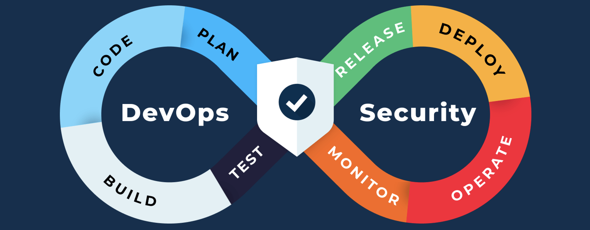

<h1 align="center">Hey there! My name is Yacin</h1>
<h3 align="center"> Junior Devops Engineer
</h3>

  

 </svg>
</a>
   &nbsp;&nbsp;
  

## 🛠️ Tech Stack

  

---

## 📎 - Projects

AWS EC2 Deployment: NGINX Web Server with Cloudflare DNS & SSL:

